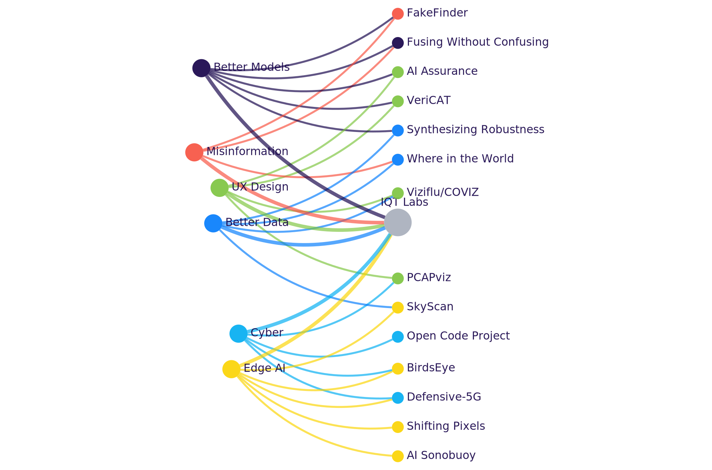

# Atlas

Atlas is a visualization tool for creating customizable, interactive graphs in a browser using [Python](https://www.python.org/download/releases/3.0/) and [Dash Cytoscape](https://dash.plotly.com/cytoscape).

> Dash is an open source Python framework for building web applications. It is built on top of Flask (development web server), Plotly (JavaScript Graphing Library) and React (JavaScript UI Library). It enables you to build dashboards using pure Python.


## Developer Quickstart

### Requirements
- [Install Docker](https://docs.docker.com/docker-for-mac/install/)
- [Add SSH Key to Github](https://help.github.com/en/github/authenticating-to-github/adding-a-new-ssh-key-to-your-github-account)

### ENV Variables

Copy the .env.example to .env in the root directory.

### Run with Docker

Update .env and set HASURA_GRAPHQL_API to the following value:
```console
HASURA_GRAPHQL_API=http://hasura:8082/v1/graphql
CLIENT_HASURA_GRAPHQL_API=http://hasura:8082/v1/graphql
```

Run Startup Script
```console
  ./startup.sh
```

This builds and starts Postgres, Hasura and Flask with Docker. View on [http://0.0.0.0:8050](http://0.0.0.0:8050)

### Run Flask locally on Mac (development):

If you don't have openssl installed locally, install it with [homebrew](https://formulae.brew.sh/formula/openssl@1.1).

```console
brew install openssl
```

Update .env and set HASURA_GRAPHQL_API to the following value:
```console
HASURA_GRAPHQL_API=http://localhost:8082/v1/graphql
```

```console
  ./startup-local-development.sh
```

This builds and starts backend services with Docker and starts Flask locally. View on [http://0.0.0.0:8050](http://0.0.0.0:8050)


## Development Tools

### Hasura GraphQL Engine
- [Install Hasura CLI](https://hasura.io/docs/1.0/graphql/core/hasura-cli/install-hasura-cli.html)

```console
[project root]#> cd hasura
[project root]#> hasura console
```

A browser opens automatically to [http://localhost:9695/](http://localhost:9695/)

### Interact with Docker Containers

```console
# View containers
#> docker ps

# Run bash inside containers
#> docker exec -it $container_name /bin/bash
# Example:
#> docker exec -it atlas_hasura /bin/bash

# Tail Logs
#> docker logs -f $(docker ps | grep -w $container_name | awk '{print $1}')
# Example:
#> docker logs -f $(docker ps | grep -w atlas_postgres_1 | awk '{print $1}')
```

## Data Sources
Atlas transforms your data to define nodes/edges and applies styling and positioning.
Atlas can read in the following data sources:

- [JSON](https://www.json.org/json-en.html)
- MSForm/xlsx (on Roadmap)
- GraphQL API (on Roadmap)


### JSON

Atlas can read two types of JSON data structures:

1. An array of defined nodes and edges

```console
  [
    # node
    {
      "data": {
        "id": "KpigKjIB6J",
        "label": "Anakin Skywalker",
        "parentId": "PL36fSGLoW"
      }
    },
    # edge
    {
      "data": {
        "source": "KpigKjIB6J",
        "target": "PL36fSGLoW",
        "id": "bdc3d32e-40c0-49b2-868f-4978eca84d6a"
      }
    },
    ...
  ]
```

2. An array of child/parent relationships

```console
  [
    {
      'id': 'KpigKjIB6J', 
      'name': 'Anakin Skywalker', 
      'homeworld': {
        'id': 'PL36fSGLoW', 
        'name': 'Tatooine'
      }
    }
    ...
  ]
```

#### :page_with_curl: Additional Example

Below is a more elaborate example of an array of defined nodes and edges that Atlas can parse into a five node, four edge graph visualization:

```json
[
  {
    "data": {
      "id": "atlascentralnode",
      "label": "Central Node 0",
      "attributes": {
          "Description": "Describe the central node here."
      }
    }
  },
  {
    "data": {
      "id": "parentnodeone",
      "label": "Parent Node 1",
      "parentId": "atlascentralnode",
      "attributes": {
          "Description": "Describe the first parent-level node here."
      }
    }
  },    
  {
    "data": {
      "id": "parentnodetwo",
      "label": "Parent Node 2",
      "parentId": "atlascentralnode",
      "attributes": {
          "Description": "Describe the second parent-level node here."
      }
    }
  },
  {
    "data": {
      "id": "childnodeone",
      "label": "Child Node 1",
      "parentId": "parentnodeone",
      "attributes": {
          "Description": "Describe the first child-level node here."
      }
    }
  },
  {
    "data": {
      "id": "childnodetwo",
      "label": "Child Node 2",
      "parentId": "parentnodetwo",
      "attributes": {
          "Description": "Describe the second child-level node here."
      }
    }
  },
  {
    "data": {
      "source": "atlascentralnode",
      "target": "parentnodeone",
      "id": "e1"
    }
  },
  {
    "data": {
      "source": "atlascentralnode",
      "target": "parentnodetwo",
      "id": "e2"
    }
  },
  {
    "data": {
      "source": "parentnodeone",
      "target": "childnodeone",
      "id": "e3"
    }
  },
  {
    "data": {
      "source": "parentnodetwo",
      "target": "childnodetwo",
      "id": "e4"
    }
  }
]
```

You may edit/rename all ids, labels, and attributes to reflect your data properties of interest, provided the edges connecting your nodes, `e1-e4 immediately above`, are numbered uniquely and prefaced with an `e`. The example above produces a visualization resembles the following:


Additionally, you may add other data attributes of your own, including images, types, and hyperlinks, as below:

```json
[
  {
    "data": {
      "id": "childnodetwo",
      "label": "Child Node 2",
      "parentId": "parentnodetwo",
      "attributes": {
          "Description": "Description goes here.",
          "Project Type": "Type goes here.",
          "Link": "https://github.com/IQTLabs",
          "Image File": "https://avatars.githubusercontent.com/u/31866669?s=200&v=4"
      }
    }
  }
]

```

## Caveat on Dataset Size

Atlas can handle datasets consisting of tens of thousands of nodes with the ability to scroll to zoom and drag the canvas to move the entire graph around.

That said, please note that "as networks [of nodes and edges] become larger and more complex, maintaining legibility is challenging. . . . Without a fixed visual reference point, it is nearly impossible for humans to use this type of display to make a visual comparison of different states of the network. (E.g., Discovering when new nodes have appeared is confusing at best, impossible at worst.)
Additionally, the same network data can look very different, depending on [parameter settings](https://github.com/IQTLabs/atlas/blob/main/hasura/migrations/1609789560447_up/up.sql#L86-L112)" (source: [prior IQT Labs research](https://blog.cyberreboot.org/a-better-way-to-visualize-whats-on-our-networks-4f87fd42da6)).

For this reason, we recommend making judicious choices about the complexity of your dataset (i.e. how many nodes and edges you include in your dataset) to avoid paying a legibility penalty later.

Additionally, we recommend familiarizing yourself with the multiple layout algorithms below, which arrange nodes and edges in very different ways.

# :triangular_ruler: Layout Algorithms

The public (deployed) version of Atlas includes a dropdown menu with 5 layout options, as follows:

|CoSE-Bilkent|Klay|Grid|Concentric|Preset|
|:--:|:--:|:--:|:--:|:--:|
|  |  |  |  | > |

In addition, if running Atlas locally, the Hasura GraphQL Engine enables users to select from one of 13 layout options, as follows:

|Layout|Description|
|:---|:---|
|Preset|The **preset** layout puts nodes in the positions you specify manually.|
|Random|The **random** layout puts nodes in random positions within the viewport.|
|Grid|The **grid** layout puts nodes in a well-spaced grid.|
|Circle|The **circle** layout puts nodes in a circle.|
|Concentric|The **concentric** layout positions nodes in concentric circles, based on a metric that you specify to segregate the nodes into levels. This layout sets the concentric value in `ele.scratch()`.|
|Breadthfirst|The **breadthfirst** layout puts nodes in a hierarchy, based on a breadthfirst traversal of the graph. It is best suited to trees and forests in its default top-down mode, and it is best suited to DAGs in its circle mode.|
|CoSE|The **cose** (Compound Spring Embedder) layout uses a physics simulation to lay out graphs. It works well with noncompound graphs and it has additional logic to support compound graphs well.|
|CoSE-Bilkent|The **cose-bilkent**, or CoSE (Compound Spring Embedder) layout for Cytoscape.js developed by i-Vis Lab in Bilkent University is a spring embedder layout with support for compound graphs (nested structures) and varying (non-uniform) node dimensions.|
|Cola|The **cola**.js physics simulation (force-directed) layout. Cola makes beautiful layout results, it animates very smoothly, and it has great options for controlling the layout. It is focussed on giving aesthetically pleasing results for relatively small graphs.|
|Euler|The **euler** layout is a fast, small file-size, high-quality force-directed (physics simulation) layout. It is good for non-compound graphs, and it has basic support for compound graphs.|
|Spread|The **spread** physics simulation (force-directed) layout tries to use all the viewport space, but it can be configured to produce a tighter result. It uses the CoSE algorithm initially, and it uses Gansner and North for the spread phase.|
|Dagre|The **dagre** layout for DAGs and trees. It organises the graph in a hierarchy.|
|Klay|The **klay** is a layout that works well for most types of graphs. It gives good results for ordinary graphs, and it handles DAGs and compound graphs very nicely.|

For more information on the layouts above, consult the [Dash Cytoscape documentation](https://dash.plotly.com/cytoscape/layout).

# Customizing Search Functions

Atlas includes a search feature with fuzzy string matching with your data `attribute`s.

To customize the search functions to your specific use-case:

- go to the Hasura [migrations directory](https://github.com/IQTLabs/atlas/tree/main/hasura/migrations)
- access the last file listed 
- modify the numerical parameter following `atlas.search_network_data(keyword)` to change the sensitivity of the default similarity search
- modify the numerical parameter following `atlas.search_network_data_lev(keyword)` to change the sensitivity of the Levenshtein Python C extension module
- re-run the app startup shell script outlined in the [Developer Quickstart](https://github.com/IQTLabs/atlas#developer-quickstart)

For more information on the search functions above, consult the [Dash Cytoscape documentation](https://dash.plotly.com/cytoscape/layout).

# :warning: Disclaimer

This repository contains code that can help you generate [Dash](https://plotly.com/dash/)-based graph visualizations using your own data. It was developed and is being released by [IQT](https://www.iqt.org/) in collaboration with [IQT Labs](https://www.iqt.org/labs/). 

*Note that we are not responsible for what you do with this code. When you load your own datasets in Atlas, you are responsible for managing the security, integrity, access control, and intellectual property rights associated with your data. There is no warranty of any kind provided with the information, code and binaries in this repo. Neither IQT nor IQT Labs is available to provide maintenance or support. You are solely responsible your usage of Atlas.*
